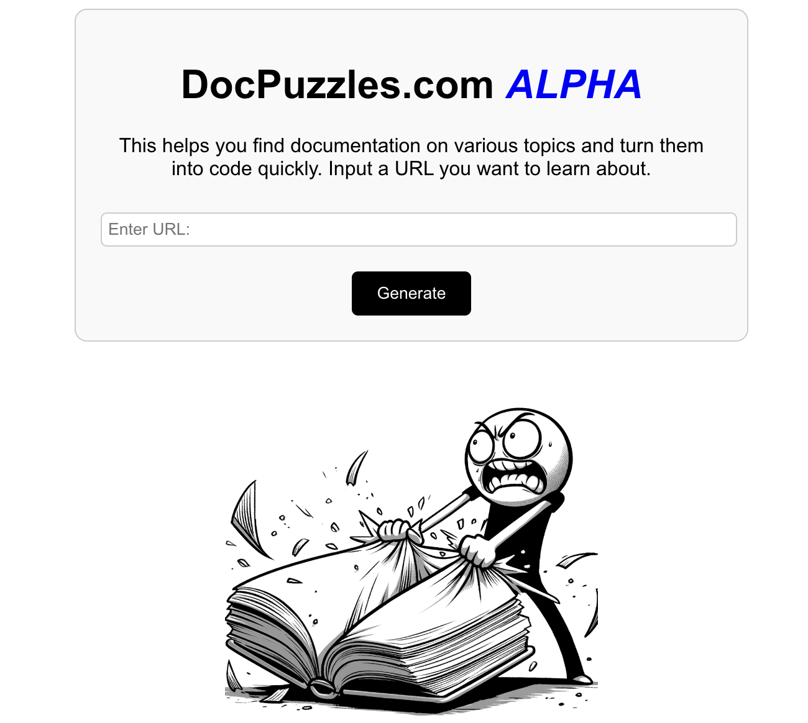

# CodeDocs
Building code puzzles for any documentation




---


## 🚀 Join Us on Our Adventure!
We are on a mission to build a documentation-to-code puzzle pipeline within 24 hours. Excited to have you on board!

---

## 🛠️ Setup Guide

1. **Download Dependencies**:  
   Ensure you have all the necessary packages by downloading from the **[requirements.txt](./codedocs/requirements.txt)** in the `codedocs` directory. We recommend using fast package installers like `uv` for Python.

2. **Install JavaScript Libraries**:  
   Navigate to the `documentation_app` folder and run the following command to install the required JavaScript libraries:
   ```bash
   npm install
   ```

3. **Add API Keys**:  
   Open the `.env` file and add your GROQ and Relevance AI API keys. These are essential for the app's functionality.

4. **Run the Application**:  
   - **Backend**: Navigate to the root directory and start the Flask app:
     ```bash
     python3 start_app.py
     ```
   - **Frontend**: Move to the `documentation_app` folder and start the React app:
     ```bash
     npm start
     ```

---

## 💡 Inspiration

Our project is inspired by the engaging puzzles created by [Sascha Rush](https://github.com/srush/GPU-Puzzles). We love the interactive way these puzzles teach new code and concepts. Our goal is to bring this interactive learning style to various types of documentation and libraries.

---

## 🎯 Demo Highlights

Our product is designed to speed up learning from documentation. It helps open-source developers quickly get up to speed with new tools, and assists companies in onboarding employees and acquainting them with company resources and products, such as AWS cloud SDKs.

### Current Features:
- **Documentation Scraper**: Extracts explanations and code snippets from documentation websites.
- **Interactive Exercises**: Converts explanations into small, gamified code exercises.
- **Solution Generation**: Provides clear and easy solutions to the exercises.
- **Code Verifier**: Uses in-built Python commands and testcases to create a psuedo-interpreter to verify the solutions' correctness
- **Sandboxed Environment**: Runs the code verification in a sandbox, so that your user environments are safe
- **Confetti**: The most important feature of our product! Celebrate when you learn!
---

### Demo Video
You can check out our Youtube demo [here!](https://youtu.be/GA_hVCqSfe0)

## 📣 Call to Action

Join us in our journey to revolutionize how documentation is learned through code puzzles. Together, we can make learning fun and interactive!

---

## 📄 Footer
Powered by Groq and Relevance AI, with love from ChatGPT
*Made with ❤️ by the CodeDocs Team*
